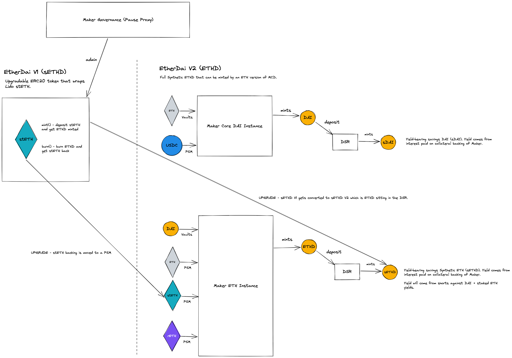

# Contracts for the Endgame and MetaDAOs

Summary of required products in more detail: https://forum.makerdao.com/t/endgame-v3-pregame-products-lod-summary/17687

## Required Pregame Contracts

### Maker Core

 - [x] Ether Dai V1
 - [x] Elixir V1 - Available as external balancer pool
 - [ ] Metanomics V1
 - [ ] Anti-Reflexivity Mechanic

 ### MetaDAOs

 - [x] MetaDAO Token
 - [ ] MetaDAO Farms - TBD
 - [ ] MetaDAO Frontend - TBD
 - [x] Meta Elixir V1 - Available as external Uniswap V2 pool

## List of all ERC20 + LP tokens

 - EtherDai [ETHD]
 - MetaDAO Token [MDAO]
 - Elixir Balancer LP (DAI/ETHD/MKR) [ELIXIR]
 - Meta Elixir Uniswap V2 LP (MDAO/MKR) [MELIXIR]

## Required Token Flows

 - Add 1-sided liquidity to Meta Elixir Uniswap V2 pool from MKR
 - Add 1-sided liquidity to Elixir Balancer pool from DAI
 - Add 1-sided liquidity to Elixir Balancer pool from MKR

## EtherDai

Below is an upgrade path for Ether Dai. V1 is included in this repository.

## MetaDAOToken

Simple ERC20 with admin minting rights.
